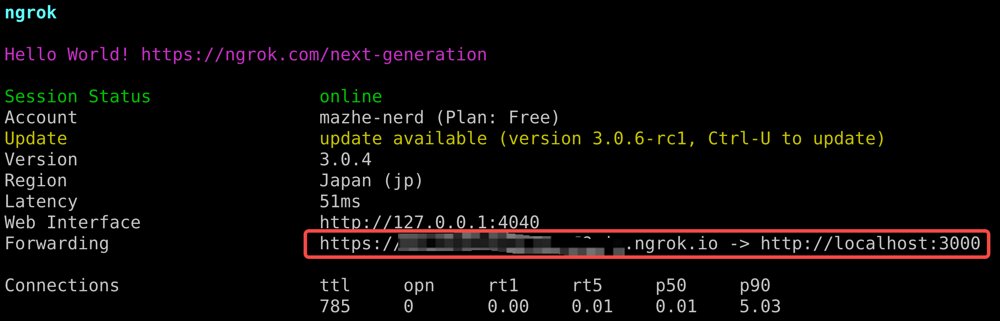
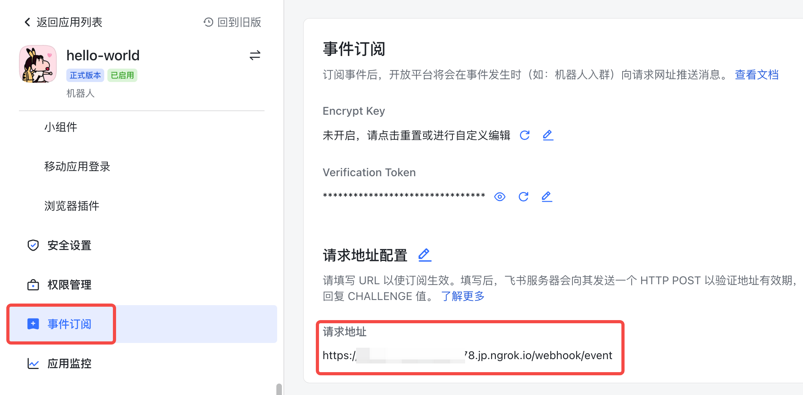
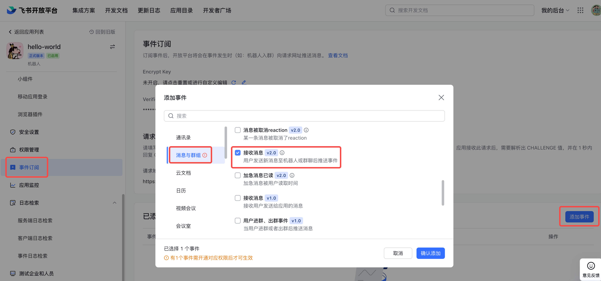
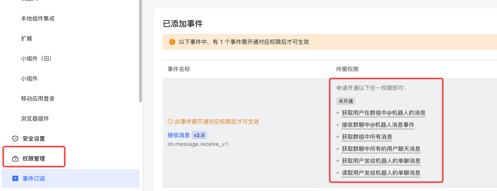
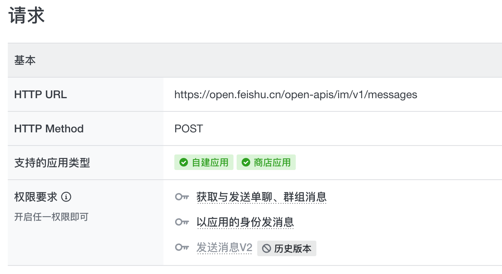
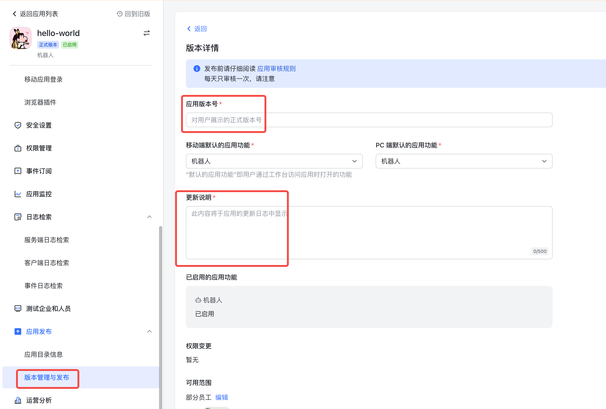

# 快速开发机器人

> ⚠️ 本教程为了方便实现，使用了反向代理工具（ngrok），该工具仅适用于开发测试阶段，不可用于生产环境。使用前需要确认是否符合所在公司网络安全政策。

本示例介绍如何使用开放平台机器人能力，完成机器人接收用户消息，并且回复消息的处理。可以基于此示例扩展机器人事件处理能力。

## 运行环境

* [nodejs](https://nodejs.org/en/)
* [npm](https://www.npmjs.com/)
* [ngrok](https://ngrok.com/download)（内网穿透工具）

## 准备工作
1、在[开发者后台](https://open.feishu.cn/app/)**新建企业自建应用**，点击应用名称进入应用详情页。

2、点击凭证与基础信息切换页面，拿到 App ID 和 App Secret值。

3、拉取最新代码到本地，并进入对应目录。
```shell
git clone git@github.com:larksuite/lark-samples.git
cd react_and_nodejs/robot-examples
```

4、将第2步拿到的APP_ID和APP_SECRET填入react_and_nodejs/robot-examples/config.js中。

5、安装依赖并运行
```shell
npm install
npm run start
```
## 完成配置，体验机器人
机器人接收的消息都会以回调事件请求形式，通过 POST 请求方式，送达到服务端处理。所以本地服务端启动之后，回调事件无法请求到内网，需要配置公网请求 URL。

配置分为如下两步：使用工具完成内网穿透、在应用的事件订阅页面配置公网请求 URL。

1、使用工具暴露本地服务的公网访问入口，此处给出 ngrok 使用示例，若本地未安装可以访问[ngrok](https://ngrok.com/download) ，按照教程完成安装。

> 注意：使用反向代理工具（ngrok）之前需要确定是否符合公司网络安全策略；需要提前在 ngrok 获取token值。

使用以下命令获得公网 URL，并将请求代理到本地3000端口：
```shell
ngrok authtoken <token> // <token>需要替换
ngrok http 3000
```

2、点击机器人切换页面>打开启用机器人开关。

3、在事件订阅页面：配置请求网址 URL（使用工具生成的域名，填写请求网址 URL，如下图所示）：

> 注意：配置请求网址URL和发送消息给机器人，都会有请求到后端服务，请求期间需要保证服务为启动状态。

4、为机器人选择监听事件。
在事件订阅页面，点击添加事件，选择`接收消息`事件并订阅。


5、申请事件订阅的权限
在**权限管理**页面，搜索订阅事件需要的权限，并开通（也可在本页面点击具体的权限项进行开通）：


6、申请调用api接口的权限（代码中使用这个api接口来让机器人发送消息）：


> 注意：本次涉及需要审核的权限，可以利用 [测试企业与人员功能](https://open.feishu.cn/document/home/introduction-to-custom-app-development/testing-enterprise-and-personnel-functions) ，生成测试版应用（无需发布，配置直接生效），完成测试。(*成功发布后，可以根据是否能搜到机器人，判断用户是否在机器人可用性范围内。*)



7、打开飞书，搜索机器人名称并开始体验机器人自动回复：
