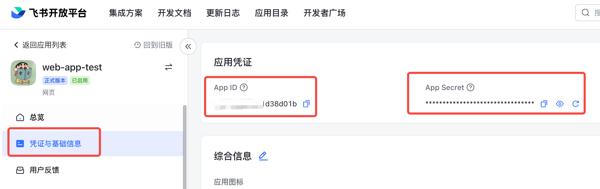
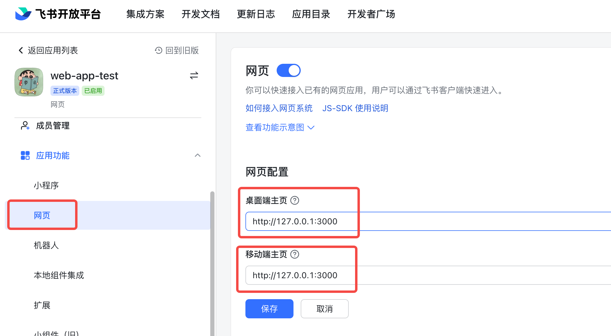
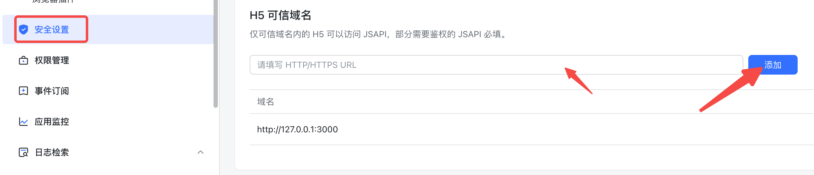
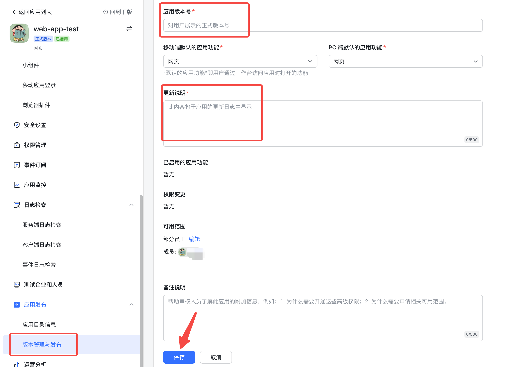
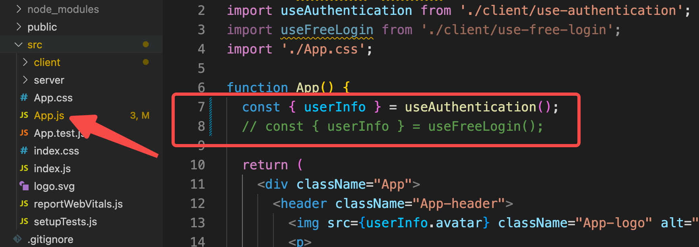
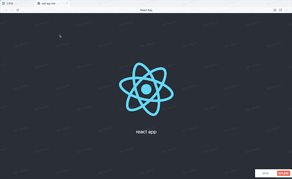
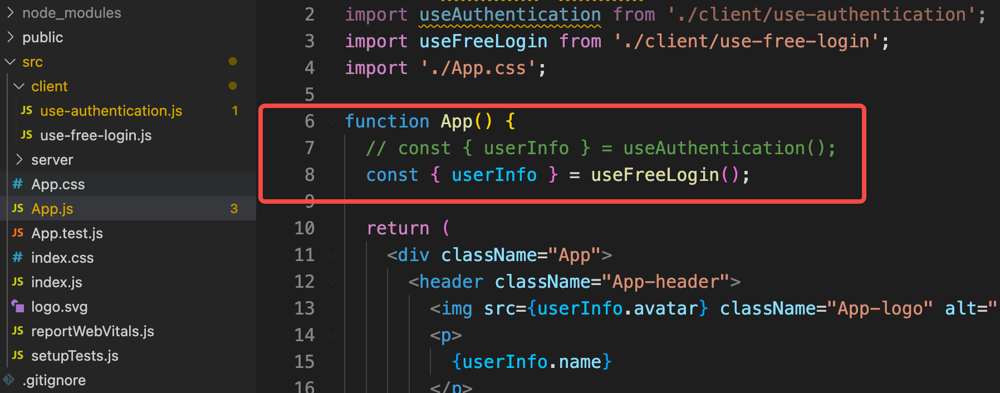

# 网页应用示例代码（node + react）
开始前确保安装了node和npm

## 准备工作
1、在[开发者后台](https://open.feishu.cn/app/)点击创建企业自建应用，创建成功之后，点击应用名称打开应用，点击凭证与基础信息切换页面，拿到 App ID 和 App Secret 信息。


2、点击网页切换页面，打开启用网页按钮，修改网页配置，填写桌面端主页和移动端主页都为http://127.0.0.1:3000即可。


3、点击安全设置，配置 h5 可信域名为http://127.0.0.1:3000即可。


4、点击版本管理与发布，创建版本并发布上线。
1. 点击创建版本，填写发版必须内容，点击保存，完成版本创建。（*注意：仅可用性范围内用户能够打开应用。*）

2. 点击申请发布，应用即时上线生效。

5、拉取最新代码到本地，并进入对应目录：
```shell
git clone git@github.com:larksuite/lark-samples.git
cd react_and_nodejs/web-app
npm install
```
6、将第1步拿到的APP_ID和APP_SECRET填入react_and_nodejs/web-app/config.js中。
## 快速开发网页应用
如果需要开发一款在飞书客户端内获取已登录用户信息的网页应用，可以参考本示例。本示例使用飞书客户端 jssdk，利用客户端登录态，完成已登录用户信息查询功能.

修改代码src/App.js代码，注释第8行：


在控制台运行以下命令：
```shell
npm run start
```

运行起来之后，只能在飞书内体验，打开飞书>工作台> 搜索应用名称> 打开应用：


## 快速开发免登应用
如果您的网页（Web）应用需要获取客户端已登录用户的信息，尤其是辨认用户身份（获取用户唯一标识符），可以参考本示例。

修改代码src/App.js代码，注释第7行：


在控制台运行以下命令：
```shell
npm run start
```

运行起来之后，只能在飞书内体验，打开飞书>工作台> 搜索应用名称> 打开应用：
